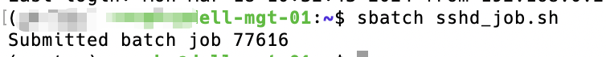

# Slurm_sshd_scripts
sshd scripts for slurm

# Function
This repository is used to apply for the GPU and use the sshd service to connect to the GPU.

You can DIRECTLY use the sshd service to connect to the GPU without any other operations, typically, you can use the sshd service to connect to the GPU in the following situations:
1. Debugging in the vscode
2. Check the GPU status in the terminal
3. Run the code in the terminal

# Usage
1. logging to the slurm sontrol node and `sbatch sshd_jobs.sh`

2. cat the job log and get the ip & port

3. connect to the computing node with the standard SSH


# Install
## login the cluster control node

## generate the ssh key
```bash
ssh-keygen -t rsa -f ~/.ssh/vcg_cluster_user_sshd
```

## clone the repository
```bash
git clone XX XX
cd Slurm_sshd_scripts
```

## modify the important things
in the `sshd/sshd_job.sh` file, you should modify the YOUR_ENVIRONMENT to your own environment.
In the `sshd/sshd_config` file, you should modify the last line and add your own name.

## move to your home directory
```bash
# mv sshd/ ~/
ln -s ${pwd}/sshd/ ~/
```

## apply for the GPU
```
sbatch ~/sshd/sshd_job.sh
```

## check the ip_port of the sshd service
```
squeue -u $USER
cat Slurm-XXX.out
```


IMPORTANT: This script preserves ONE GPU for 24 hours by default

If you have any questions, please feel free to contact me.

If you find this repository useful, please give me a star, thank you very much! 

